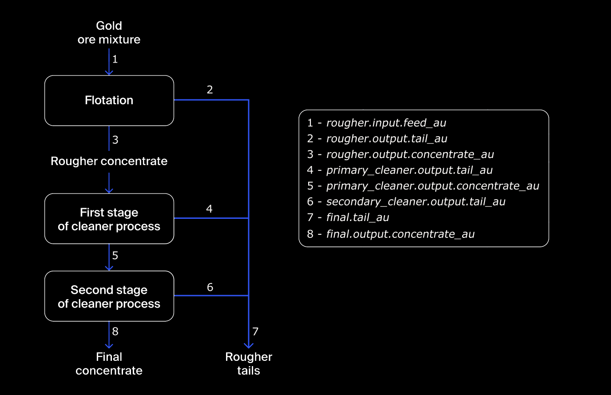

# Integrated Project 2

## Task statement

Prepare a prototype of a machine learning model for Zyfra. The company develops efficiency solutions for heavy industry.

The model should predict the amount of gold recovered from gold ore. You have the data on extraction and purification.

The model will help to optimize the production and eliminate unprofitable parameters.

## Technological Process

Mined ore undergoes primary processing to get the ore mixture or rougher feed, which is the raw material for flotation (also known as the rougher process). After flotation, the material is sent to two-stage purification.

1. **Flotation**

    Gold ore mixture is fed into the float banks to obtain rougher Au concentrate and rougher tails (product residues with a low concentration of valuable metals). 
    
    The stability of this process is affected by the volatile and non-optimal physicochemical state of the flotation pulp (a mixture of solid particles and liquid).

2. **Purification**

    The rougher concentrate undergoes two stages of purification. After purification, we have the final concentrate and new tails.

## Data description
**Technological Process**

- Rougher feed — raw material
- Rougher additions (or reagent additions) — flotation reagents: Xanthate, Sulphate, Depressant

    - Xanthate — promoter or flotation activator;
    - Sulphate — sodium sulphide for this particular process;
    - Depressant — sodium silicate.
    
- Rougher process — flotation
- Rougher tails — product residues
- Float banks — flotation unit
- Cleaner process — purification
- Rougher Au — rougher gold concentrate
- Final Au — final gold concentrate

**Parameters of Stages**
- air amount — volume of air
- fluid levels
- feed size — feed particle size
- feed rate

## Feature Naming

Here's how you name the features:

`[stage].[parameter_type].[parameter_name]`

Example: `rougher.input.feed_ag`

Possible values for `[stage]`:

- rougher — flotation
- primary_cleaner — primary purification
- secondary_cleaner — secondary purification
- final — final characteristics

Possible values for `[parameter_type]`:

- input — raw material parameters
- output — product parameters
- state — parameters characterizing the current state of the stage
- calculation — calculation characteristics

## Recovery Calculation

You need to simulate the process of recovering gold from gold ore.

Use the 'Recovery' formula to simulate the recovery process:

- C — share of gold in the concentrate right after flotation (for finding the rougher concentrate recovery)/after purification (for finding the final concentrate recovery)
- F — share of gold in the feed before flotation (for finding the rougher concentrate recovery)/in the concentrate right after flotation (for finding the final concentrate recovery)
- T — share of gold in the rougher tails right after flotation (for finding the rougher concentrate recovery)/after purification (for finding the final concentrate recovery)

To predict the coefficient, you need to find the share of gold in the concentrate and the tails. Note that both final and rougher concentrates matter.

## Evaluation Metric

To solve the problem, we will need new metrics. 

sMAPE (symmetric Mean Absolute Percentage Error):

We need to predict two values:

1. rougher concentrate recovery `rougher.output.recover`
2. final concentrate recovery `final.output.recovery`

Final sMAPE is clculated using these two values:

## Project Description

The data is stored in three files:

`gold_recovery_train.csv` — training dataset download
`gold_recovery_test.csv` — test dataset download
`gold_recovery_full.csv` — source dataset download

Data is indexed with the date and time of acquisition. Parameters that are next to each other in terms of time are often similar.

Some parameters are not available because they were measured and/or calculated much later. That's why, some of the features that are present in the training set may be absent from the test set. The test set also doesn't contain targets.

The source dataset contains the training and test sets with all the features.

You have the raw data that was only downloaded from the warehouse. Before building the model, check the correctness of the data.

### Porject Instructions

1. **Prepare the Data**

    1.1. Open the files and look into the data.

    Path to files:
    - `/datasets/gold_recovery_train.csv`
    - `/datasets/gold_recovery_test.csv`
    - `/datasets/gold_recovery_full.csv`

    1.2. Check that recovery is calculated correctly. Using the training set, calculate recovery for the rougher.output.recovery feature. Find the MAE between your calculations and the feature values. Provide findings.
    
    1.3. Analyze the features not available in the test set. What are these parameters? What is their type?
    
    1.4. Perform data preprocessing.

2. **Analyze the Data**

    2.1. Take note of how the concentrations of metals (Au, Ag, Pb) change depending on the purification stage.

    2.2. Compare the feed particle size distributions in the training set and in the test set. If the distributions vary significantly, the model evaluation will be incorrect.

    2.3. Consider the total concentrations of all substances at different stages: raw feed, rougher concentrate, and final concentrate. Do you notice any abnormal values in the total distribution? If you do, is it worth removing such values from both samples? Describe the findings and eliminate anomalies.

3. **Build the Model**

    3.1. Write a function to calculate the final sMAPE value.

    3.2. Train different models. Evaluate them using cross-validation. Pick the best model and test it using the test sample. Provide findings.
